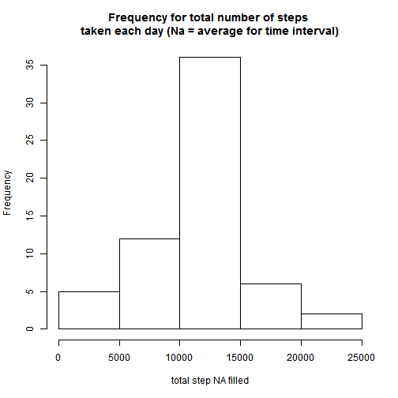

# Reproducible Research: Peer Assessment 1
### Introduction:

 It is now possible to collect a large amount of data about personal movement using activity monitoring devices such as a Fitbit, Nike Fuelband, or Jawbone Up. These type of devices are part of the "quantified self" movement - a group of enthusiasts who take measurements about themselves regularly to improve their health, to find patterns in their behavior, or because they are tech geeks. But these data remain under-utilized both because the raw data are hard to obtain and there is a lack of statistical methods and software for processing and interpreting the data.

 This assignment makes use of data from a personal activity monitoring device. This device collects data at 5 minute intervals through out the day. The data consists of two months of data from an anonymous individual collected during the months of October and November, 2012 and include the number of steps taken in 5 minute intervals each day.


## Loading and preprocessing the data
### Data Details:

#### The data for this assignment can be downloaded from the course web site: https://d396qusza40orc.cloudfront.net/repdata%2Fdata%2Factivity.zip

The variables included in this dataset are:

__steps__: Number of steps taking in a 5-minute interval (missing values are coded as NA)

__date__: The date on which the measurement was taken in YYYY-MM-DD format

__interval__: Identifier for the 5-minute interval in which measurement was taken

The dataset is stored in a comma-separated-value (CSV) file and there are a total of __17,568__ observations in this dataset.

The archive is downloaded, unzipped and then saved in the directory: __./data__ ; the directory __./data__ is created, if it not exists:

```r
if (!file.exists("./data")) {
    dir.create("./data")
}
fileUrl <- "http://d396qusza40orc.cloudfront.net/repdata%2Fdata%2Factivity.zip"
download.file(fileUrl, destfile = "./data/activity.zip")
unzip("./data/activity.zip", exdir = "./data", overwrite = TRUE)
act1 <- read.csv("./data/activity.csv", sep = ",", na.strings = "NA")
```


### Remove rows with NAs: 


```r
act <- act1[complete.cases(act1), ]
```


## What is mean total number of steps taken per day?
### Compute  total steps for each day: 


```r
aggrstep <- aggregate(act$steps, list(act$date), sum)
names(aggrstep) <- c("date", "totsteps")
```


## What is the average daily activity pattern?

### Make histogram for total steps for each day: 


```r
hist(aggrstep$totsteps, main = "Frequency for total number of steps taken each day", 
    xlab = "total step")
```

 


### Compute  the __mean__ and __median__ total number of steps taken per day: 


```r
mean(aggrstep$totsteps)
```

```
## [1] 10766
```

```r
median(aggrstep$totsteps)
```

```
## [1] 10765
```


### Make a time series plot (i.e. type = "l") of the 5-minute interval (x-axis) and the average number of steps taken, averaged across all days (y-axis)

Compute average numebr of steps for time interval:


```r
avgs <- aggregate(act$steps, list(act$interval), mean)
names(avgs) <- c("interval", "average")
head(avgs)
```

```
##   interval average
## 1        0 1.71698
## 2        5 0.33962
## 3       10 0.13208
## 4       15 0.15094
## 5       20 0.07547
## 6       25 2.09434
```

```r
maxavg <- paste("Interval with max avg steps =", subset(avgs$interval, avgs$average == 
    max(avgs$average)))
```


Create plot:


```r
library("ggplot2")
g <- ggplot(avgs, aes(interval, average))
g + geom_line() + labs(x = "5-minute interval") + labs(y = "Average stesps number") + 
    labs(title = "Average steps for 5  minute interval") + geom_vline(xintercept = 835, 
    colour = "blue", linetype = "longdash") + annotate("text", y = -9.2, x = 835, 
    label = maxavg, colour = "blue")
```

 


### Which 5-minute interval, on average across all the days in the dataset, contains the maximum number of steps?

#### Report 5 minute interval with maximum number of steps on average as shown on plot:


```r
subset(avgs$interval, avgs$average == max(avgs$average))
```

```
## [1] 835
```


## Imputing missing values
#### Imputing missing values

### Note that there are a number of days/intervals where there are missing values (coded as NA). The presence of missing days may introduce bias into some calculations or summaries of the data.

### Calculate and report the total number of missing values in the dataset (i.e. the total number of rows with NAs)


```r
nrow(act1) - nrow(act1[complete.cases(act1), ])
```

```
## [1] 2304
```


### Devise a strategy for filling in all of the missing values in the dataset. The strategy does not need to be sophisticated. For example, you could use the mean/median for that day, or the mean for that 5-minute interval, etc. Create a new dataset that is equal to the original dataset but with the missing data filled in.

#### The strategy chosen is to use the rounded average steps value, for 5 minutes interval missing value.

#### Merging original table and average steps table, substitute missing values, and rebuild original table order and structure:

```r
act1m <- merge(act1, avgs)

act1m$steps[is.na(act1m$steps)] <- round(act1m$average, 0)[is.na(act1m$steps)]

act1mfilled <- as.data.frame(cbind(steps = act1m$steps, date = as.character(act1m$date), 
    interval = act1m$interval))

act1mfilled$interval <- as.integer(as.character(act1mfilled$interval))

act1mfilled$steps <- as.integer(as.character(act1mfilled$step))

act1mfilledord <- act1mfilled[with(act1mfilled, order(date)), ]
```

#### Comparing the structures original vs. filled

```r
str(act1)
```

```
## 'data.frame':	17568 obs. of  3 variables:
##  $ steps   : int  NA NA NA NA NA NA NA NA NA NA ...
##  $ date    : Factor w/ 61 levels "2012-10-01","2012-10-02",..: 1 1 1 1 1 1 1 1 1 1 ...
##  $ interval: int  0 5 10 15 20 25 30 35 40 45 ...
```

```r
str(act1mfilledord)
```

```
## 'data.frame':	17568 obs. of  3 variables:
##  $ steps   : int  2 0 0 0 0 2 1 1 0 1 ...
##  $ date    : Factor w/ 61 levels "2012-10-01","2012-10-02",..: 1 1 1 1 1 1 1 1 1 1 ...
##  $ interval: int  0 5 10 15 20 25 30 35 40 45 ...
```

#### Comparing the data  original vs. filled

```r
head(act1, 7)
```

```
##   steps       date interval
## 1    NA 2012-10-01        0
## 2    NA 2012-10-01        5
## 3    NA 2012-10-01       10
## 4    NA 2012-10-01       15
## 5    NA 2012-10-01       20
## 6    NA 2012-10-01       25
## 7    NA 2012-10-01       30
```

```r
head(act1mfilledord, 7)
```

```
##     steps       date interval
## 1       2 2012-10-01        0
## 63      0 2012-10-01        5
## 128     0 2012-10-01       10
## 205     0 2012-10-01       15
## 264     0 2012-10-01       20
## 327     2 2012-10-01       25
## 376     1 2012-10-01       30
```


## Are there differences in activity patterns between weekdays and weekends?
### Make a histogram of the total number of steps taken each day and Calculate and report the mean and median total number of steps taken per day. Do these values differ from the estimates from the first part of the assignment? What is the impact of imputing missing data on the estimates of the total daily number of steps?

### Compute  total steps for each day _with NA filled_: 


```r
aggrstepfilled <- aggregate(act1mfilledord$steps, list(act1mfilledord$date), 
    sum)
names(aggrstepfilled) <- c("date", "totsteps")
```


### Histogram for total steps for each day _with NA filled_: 


```r
hist(aggrstepfilled$totsteps, main = "Frequency for total number of steps \ntaken each day (Na = average for time interval)", 
    xlab = "total step NA filled")
```

 


### Compute  the __mean__ and __median__ total number of steps taken per day _with NA filled_: 


```r
mean(aggrstepfilled$totsteps)
```

```
## [1] 10766
```

```r
median(aggrstepfilled$totsteps)
```

```
## [1] 10762
```


#### Because we chosen to fill the NA values with the average step for each interval, the values have almost no difference, showing a little variation in median, and no variation in the mean values, as espected.

### Are there differences in activity patterns between weekdays and weekends?

### For this part the weekdays() function may be of some help here. Use the dataset with the filled-in missing values for this part.

### Create a new factor variable in the dataset with two levels - "weekday" and "weekend" indicating whether a given date is a weekday or weekend day.

### Make a panel plot containing a time series plot (i.e. type = "l") of the 5-minute interval (x-axis) and the average number of steps taken, averaged across all weekday days or weekend days (y-axis). The plot should look something like the following, which was creating using simulated data:

#### Change my locale to obtain English week names rather then Italian, then transform date in POSIXt format:

```r
Sys.setlocale(category = "LC_ALL", locale = "C")
```

```
## [1] "C"
```

```r
act1mfilledord$date <- as.POSIXct(as.character(act1mfilledord$date), format = "%Y-%m-%d")
```


#### Create a new column in data frame named: daytype, and filling all with "weekday": 

```r
act1mfilledord$daytype <- "weekday"
```


#### Fill weekend days with "weekend" string, and transofrm daytype in factor: 

```r
act1mfilledord$daytype[weekdays(act1mfilledord$date) %in% c("Saturday", "Sunday")] <- "weekend"

act1mfilledord$daytype <- as.factor(act1mfilledord$daytype)

str(act1mfilledord)
```

```
## 'data.frame':	17568 obs. of  4 variables:
##  $ steps   : int  2 0 0 0 0 2 1 1 0 1 ...
##  $ date    : POSIXct, format: "2012-10-01" "2012-10-01" ...
##  $ interval: int  0 5 10 15 20 25 30 35 40 45 ...
##  $ daytype : Factor w/ 2 levels "weekday","weekend": 1 1 1 1 1 1 1 1 1 1 ...
```

```r
head(act1mfilledord)
```

```
##     steps       date interval daytype
## 1       2 2012-10-01        0 weekday
## 63      0 2012-10-01        5 weekday
## 128     0 2012-10-01       10 weekday
## 205     0 2012-10-01       15 weekday
## 264     0 2012-10-01       20 weekday
## 327     2 2012-10-01       25 weekday
```

####  Compute the average steps per interval, across weekday or weekend

```r
avgwd <- aggregate(act1mfilledord$steps[act1mfilledord$daytype == "weekday"], 
    list(act1mfilledord$interval[act1mfilledord$daytype == "weekday"]), mean)
names(avgwd) <- c("interval", "avgdaytype")
merwd <- merge(act1mfilledord[act1mfilledord$daytype == "weekday", ], avgwd)
avgwe <- aggregate(act1mfilledord$steps[act1mfilledord$daytype == "weekend"], 
    list(act1mfilledord$interval[act1mfilledord$daytype == "weekend"]), mean)
names(avgwe) <- c("interval", "avgdaytype")
merwe <- merge(act1mfilledord[act1mfilledord$daytype == "weekend", ], avgwe)
head(merwd)
```

```
##   interval steps       date daytype avgdaytype
## 1        0     2 2012-10-01 weekday      2.289
## 2        0     2 2012-11-30 weekday      2.289
## 3        0     0 2012-11-07 weekday      2.289
## 4        0     0 2012-11-20 weekday      2.289
## 5        0     0 2012-11-12 weekday      2.289
## 6        0    10 2012-10-22 weekday      2.289
```

```r
head(merwe)
```

```
##   interval steps       date daytype avgdaytype
## 1        0     0 2012-10-06 weekend       0.25
## 2        0     0 2012-11-25 weekend       0.25
## 3        0     2 2012-11-04 weekend       0.25
## 4        0     0 2012-11-17 weekend       0.25
## 5        0     2 2012-11-10 weekend       0.25
## 6        0     0 2012-10-21 weekend       0.25
```

#### Reunion, reorder, and rounding  as original of data frame containing average steps per interval, across weekday or weekend

```r
avgdaytype <- rbind(merwd, merwe)
avgdaytypeord <- avgdaytype[with(avgdaytype, order(date)), ]
avgdaytypeord$avgdaytype <- round(avgdaytypeord$avgdaytype)
head(avgdaytypeord)
```

```
##     interval steps       date daytype avgdaytype
## 1          0     2 2012-10-01 weekday          2
## 53         5     0 2012-10-01 weekday          0
## 124       10     0 2012-10-01 weekday          0
## 165       15     0 2012-10-01 weekday          0
## 206       20     0 2012-10-01 weekday          0
## 237       25     2 2012-10-01 weekday          2
```

#### Final plot as requested

```r
library(lattice)
xyplot(avgdaytypeord$avgdaytype ~ avgdaytypeord$interval | avgdaytypeord$daytype, 
    type = "l", layout = c(1, 2), xlab = "Interval", ylab = "Number of steps")
```

 


Author: 
G. Campana

